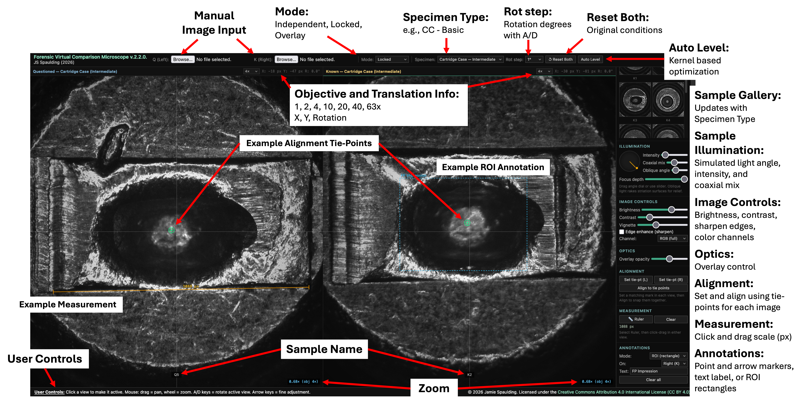

# Virtual Comparison Microscope Web Interface
## Overview
Welcome to the Forensic Virtual Comparison Microscope (VCM). This web-based application simulates the functionality of a forensic comparison microscope and allows users to examine and compare digital images of cartridge cases, bullets, and toolmarks. The tool enables side-by-side viewing, documentation, navigation, and alignment of questioned and known specimens to facilitate the observation of class and individual characteristics commonly evaluated during forensic firearm and toolmark examinations.  

This VCM is intended as an educational resource for students learning the principles of comparative examination in forensic science. Through guided exercises, users will develop skills in observing microscopic features, assessing microscopic agreement and disagreement between specimens, and applying forensic reasoning to reach conclusions.  

## Contents
[Accessing the Virtual Comparison Microscope](#Accessing-the-Virtual-Comparison-Microscope)  
[Understanding the Interface](#Understanding-the-Interface)  
[Example Student Examination Procedure](#Example-Student-Examination-Procedure)  
[Usage and Distribution](#Usage-and-Distribution)  
[Miscellaneous](#Miscellaneous) 

## Accessing the Virtual Comparison Microscope
1. Open a browser (Chrome, Firefox or Safari recommended). Navigate to: [https://jsspaulding.github.io/VCM-app](https://jsspaulding.github.io/VCM-app)  
2. The interface will display two image panels side by side. The left panel is the Questioned (Q) specimen field, and the right panel is the Known (K) specimen field.  
3. Select the appropriate "Specimen Type" dropdown in the toolbar to begin the exercise of choice. It is recommended to begin with the "Cartridge Case – Basic" tier.  

## Understanding the Interface
Locate and identify each of the following controls before proceeding. Check each item as you find it:
-	*Specimen Type selector (toolbar, top):* switches the image library between Basic, Intermediate, and Advanced tiers
-	*Load into selector and file input buttons:* used to load images into the Left (Q) or Right (K) field
-	*Sample Gallery (side panel):* thumbnail grid of available specimens; click any thumbnail to load it into the selected field
-	*Objective selector (above each field):* changes optical magnification (1x, 2x, 4x, 10x, 20x, 40x, 63x)
-	*Stage readout (header bar of each field):* displays current X/Y pan position in pixels and rotation angle in degrees
-	*Mode selector (toolbar):* choose Independent, Locked (both fields move together), or Overlay
-	*Illumination controls (side panel):* light angle dial, intensity, coaxial mix, and focus depth sliders. Note several samples are already illuminated and it may be easier to turn this down to a low level. 
-	*Image Controls (side panel):* brightness, contrast, edge enhancement, color channel selection
-	*Measurement ruler (side panel):* click-drag in a field to measure distances between features
-	*Annotation tools (side panel):* place point markers, arrows, region-of-interest boxes, and text labels
-	*Keyboard shortcuts:* A/D = rotate left/right; Arrow keys = pan; Tab = switch active field

A screen capture of the VCM user interface with labels is provided below.  

## Example Student Examination Procedure
Follow this procedure for every comparison pair in all Specimen Type tiers. I have also provided a [complete laboratory protocol with fillable answer sheets](VCM-lab-Protocol.docx) that is used in my introductory course.  

**Step 1: Load the Specimen Pair**
1. In the Sample Gallery, confirm the correct tier is selected in the Specimen Type dropdown.
2. Set the "Load into" selector to "Left (Q)." Click the questioned specimen thumbnail (Q1, Q2, etc.). The image will appear in the left field.
3. Set the "Load into" selector to "Right (K)." Click the corresponding known specimen thumbnail (K1, K2, etc.).
4. Confirm the sample name badge appears beneath each image in its respective field.
Alternately, you can upload an image to the respective sample view from your computer using the "Choose File" buttons at the top of the interface.

**Step 2: Initial Survey at Low Magnification**  
1. Set both objective selectors to a lower power (e.g., 4x) where you can visualize the entire sample. Use this magnification for your initial assessment.
2. Set the Mode selector to "Locked." Pan and zoom will now operate on both fields simultaneously, making it easier to compare equivalent areas.
3. Examine the overall appearance of each specimen. For cartridge cases: identify the firing pin impression, the breech face impressions present, and any other markings of note on the primer surface. For fired bullets, note the general appearance of the land engraved areas. 
4. Appropriately document visible class characteristics (caliber, firing pin shape, rifling number/width, tool type, etc.). Assess visible damage, deformation, or obliteration. Record any additional observations of note at this stage. Capture overall images using a screen capture tool.  
The VCM interface allows you to add annotations directly to the images which you can screen capture as well.
    1. "Point marker" mode: on each field, click to place a marker on noteworthy features (either support or refute comparison decision)
    2. "Label" mode: enter a brief label in the Annotation Text field (e.g., "FP aperture shear") and click on the marked feature to attach the label.
    3. "ROI" mode: drag a rectangle around the primary area of interest in each field and the label will be attached.
5. While under low magnification, orient the surfaces such that they are aligned. The alignment tool can be used to set tie points in each image for alignment.
    1. Click "Set tie-pt (L)" and click on a distinctive striation mark in the left field. Click "Set tie-pt (R)" and click on the corresponding mark in the right field.
    2. Click "Align to tie points." The left field will translate so the two marks coincide. Examine the surrounding area for correspondence of adjacent features.

**Step 3: Illuminate for Surface Relief**  
*Important note:* some samples were captured with coaxial and/or oblique lighting and may be best visualized with an intensity of zero.  
1. Switch the Mode selector to "Independent."
2. In the Illumination panel, adjust the Light Angle slider or click the angle dial to position the light at approximately 45°. Observe how striations and surface impressions/texture become visible as light and shadow relief.
3. Adjust the Intensity slider (start low and increase as needed) and Coaxial Mix slider (start at 25–30%). The goal is to maximize the visibility of individual marks without losing detail in shadows.
4. Apply the same illumination settings to both fields. Note that different specimens may benefit from slightly different angles, you may adjust independently per field.

**Step 4: Systematic Examination at Higher Magnification**  
1. Increase the objective power for detailed examination.
2. Work through each major feature area systematically and capture micrograph captures of significant features:
    1. Breechface impressions: marks impressed into the primer and surrounding surface by machined imperfections on the firearm’s bolt face. Examine the pattern, density, and angular orientation.
    2. Firing pin impression: marked impression from the firing pin engaging the primer surface. Also note firing pin drag marks which are elongated tear-like scrapes extending from the firing pin’s indentation on the primer. These occur when the slide begins to recoil and unlock, pulling the cartridge casing away before the firing pin has fully retracted into the breech block.
    3. Firing pin aperture marks: marks around the firing pin impression left by the edges of the firing pin aperture in the breech block. Note the shape, depth, and any asymmetries. There may be shear marks left on the primer which occur when the primer flows backward under pressure and is physically sheared or scraped against the edges of the firing pin aperture as the firearm cycles 
    4. Ejector marks: Impression or scrape produced by the ejector as the case is expelled. Note location, shape, and any associated marks. Note: not present on all CC sample images.
3. For each feature area, rotate and pan the specimens to align the corresponding region in both fields. Use the A/D keys for fine rotation. 
4. Perform Side-by-Side Comparison:
    1. Align questioned and known items in the comparison microscope
    2. Compare class characteristics for consistency
    3. Evaluate individual characteristics for agreement or disagreement
    4. Rotate, tilt, and adjust lighting to reveal striated or impressed detail
    5. Document all observed similarities and differences. See note on Annotation tool in Step 4.  
Once aligned, use of the "Locked" function mode will move the samples simultaneously which will assist in evaluation of feature prevalence on both samples.  

**Step 5: Reach and Document Conclusions**  
1. Based on your examination, reach a conclusion using the AFTE framework:
    1. **Source Identification:** conclusion that two toolmarks originated from the same source. This conclusion is an examiner’s opinion that all observed class characteristics are in agreement and the quality and quantity of corresponding individual characteristics is such that the examiner would not expect to find that same combination of individual characteristics repeated in another source and has found insufficient disagreement of individual characteristics to conclude they originated from different sources.
    2. **Inconclusive:** conclusion that all observed class characteristics are in agreement but there is insufficient quality and/or quantity of corresponding individual characteristics such that the examiner is unable to identify or exclude the two toolmarks as having originated from the same source.
    3. **Source Elimination:** conclusion that two toolmarks did not originate from the same source. The basis for a ‘source exclusion’ conclusion is an examiner’s opinion that the observed class and/or individual characteristics provide extremely strong support for the proposition that the two toolmarks came from different sources and extremely weak or no support for the proposition that the two toolmarks came from the same source.
2. Record your conclusion and a written justification citing specific observed features. Record the basis for conclusion referencing observed characteristics, include annotated captures supporting findings. Ensure your notes are complete, contemporaneous, and reproducible.
    1. If you feel uncertain, record your observations and reasoning honestly. In professional practice, an Inconclusive conclusion is appropriate and important, it is not a failure. The quality of your reasoning is more important than reaching a definitive conclusion.
3. Proceed to the next specimen pair. 

## Usage and Distribution
Shield: [![CC BY 4.0][cc-by-shield]][cc-by]

This work is licensed under a
[Creative Commons Attribution 4.0 International License][cc-by].

[![CC BY 4.0][cc-by-image]][cc-by]

[cc-by]: http://creativecommons.org/licenses/by/4.0/
[cc-by-image]: https://i.creativecommons.org/l/by/4.0/88x31.png
[cc-by-shield]: https://img.shields.io/badge/License-CC%20BY%204.0-lightgrey.svg

## Miscellaneous
For support or answer keys, please contact [jspaul@bgsu.edu](mailto:jspaul@bgsu.edu).
